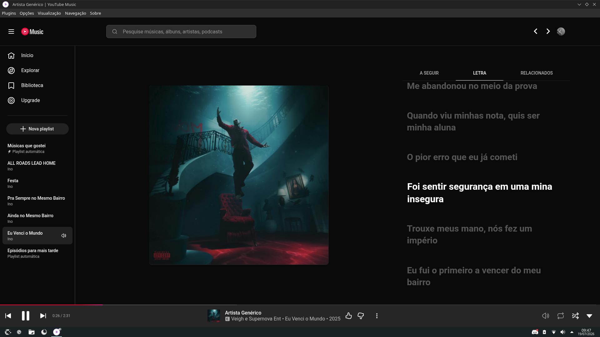
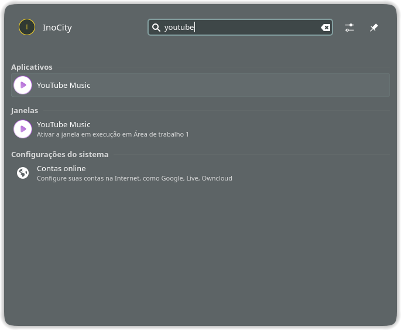

# **Pear-Desktop-Installer**

An easy and lightweight Pear Desktop installer, using **AppImage** and a simple **.sh script** — cleaner and more flexible than Flatpak, with **no bugs from Flatpak**.





---

## Installation

After downloading the installer, run it with:

```bash
sh /path/to/YTMusicInstaller.sh
```

The script will handle everything automatically (dependencies, setup, and execution), and **there is no need to run it from the terminal after installation** — it automatically creates a menu entry, so you can launch it from your system app menu.

---

## Notes

* No Flatpak required
* Portable AppImage
* Simple and fast installation

## Tips

To enable AD Blocking, go in **Plugins** > Do Not Track

And be happy listening to your favorite songs! :D
